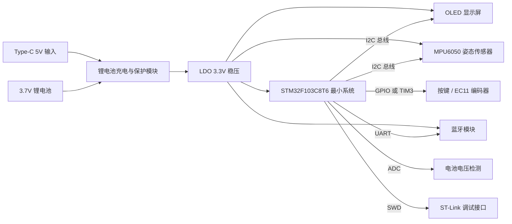
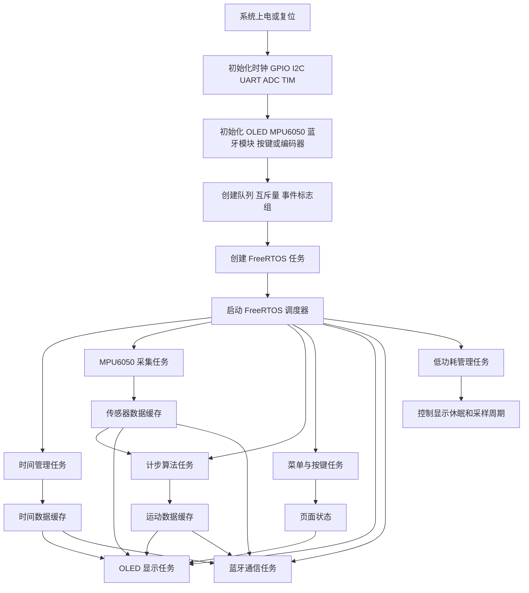

# 嵌入式系统课程设计——设计文档提交与汇报

| 项目 | 内容 |
| --- | --- |
| 课程设计题目 | 基于 STM32F103C8T6 的智能手表设计 |
| 开发平台 | STM32F103C8T6、FreeRTOS |
| 主要外设 | OLED 显示屏、MPU6050、旋转编码器/按键、蓝牙模块、电源管理模块 |
| 提交阶段 | 系统设计文档提交与汇报 |
| 提交时间 | 2026 年 7 月 2 日 9:00 |

本阶段文档依据《嵌入式系统课程设计.md》中“设计文档提交与汇报”的要求整理，内容包括物料到位情况、系统方案设计、详细设计文档和进度汇报。项目题目、功能范围、器件选型和进度安排以《项目计划书.md》中的“基于 STM32F103C8T6 的智能手表设计”为准。由于项目计划书中未单独记录快递签收或实物领用时间，物料状态按计划书、实验室常用物料和当前阶段整理；未能现场复核的项目统一标注为“待确认”。

## 1. 物料到位情况

### 1.1 已到货物料清单

| 序号 | 物料名称 | 型号 / 参数 | 数量 | 当前状态 | 用途说明 |
| --- | --- | --- | --- | --- | --- |
| 1 | STM32F103C8T6 最小系统板 | Blue Pill 或同类开发板 | 1 | 实验室已有或已领取，待通电复核 | 系统主控、运行 FreeRTOS 和各外设驱动 |
| 2 | OLED 显示屏 | 1.3 寸 I2C OLED，128x64；若使用现有 MK993/SSD1306 模块则软件兼容 | 1 | 已纳入核心物料，实物尺寸待确认 | 显示时间、菜单、姿态数据和运动数据 |
| 3 | MPU6050 模块 | GY-521 或同类 6 轴 IMU，I2C 接口 | 1 | 已纳入核心物料，待 WHO_AM_I 复核 | 采集三轴加速度和三轴角速度 |
| 4 | 常用阻容元件 | 4.7 kΩ / 10 kΩ 电阻、0.1 uF / 10 uF 电容等 | 若干 | 实验室常用库存，待清点 | I2C 上拉、按键上拉、滤波和去耦 |
| 5 | 杜邦线 | 公对母、母对母 | 1 套 | 实验室已有，待清点 | 原型阶段模块连接 |
| 6 | 面包板 / 洞洞板 | 小型面包板或洞洞板 | 1 | 实验室已有或可领用，待确认 | 原型搭建和模块固定 |
| 7 | 排针 | 2.54 mm 排针 | 1 批 | 实验室常用库存，待确认 | 模块焊接和扩展接口 |
| 8 | 独立按键 | 轻触按键 | 3 | 实验室常用库存，待确认 | 调试输入、复位或备用菜单按键 |
| 9 | ST-Link 调试器 | ST-Link V2 或板载调试器 | 1 | 实验室已有或自备，待确认 | 程序下载、在线调试 |

### 1.2 实物核对情况

| 核对项目 | 核对内容 | 当前结论 |
| --- | --- | --- |
| 主控板型号 | 确认芯片丝印为 STM32F103C8T6 或兼容型号，SWDIO/SWCLK、3.3V、GND 引脚可用 | 待通电复核 |
| 供电端口 | 检查 3.3V 与 GND 是否短路，确认可由 ST-Link、USB 或外部稳压模块供电 | 待万用表复核 |
| OLED 模块 | 核对屏幕尺寸、控制器和 I2C 地址，优先按 SSD1306、地址 0x3C 调试 | 待 I2C 扫描确认 |
| MPU6050 模块 | 核对 VCC、GND、SCL、SDA、AD0 引脚，AD0 默认接地时地址应为 0x68 | 待读取 WHO_AM_I 确认 |
| I2C 总线 | 检查 SCL/SDA 上拉电阻是否板载；如无板载上拉，外接 4.7 kΩ 至 3.3V | 待实测确认 |
| 按键 / 编码器输入 | 检查按键导通状态、上拉方式和机械抖动情况 | 待确认 |
| 电源模块 | 检查 LDO 输出是否稳定为 3.3V，电池和 Type-C 充电模块接线是否正确 | 待确认 |
| 蓝牙模块 | 确认具体型号为 HC-05、HM-10 或 BLE 透传模块，核对 UART 波特率和供电电压 | 待确认 |

### 1.3 未到货物料及预计到位时间

| 序号 | 物料名称 | 型号 / 参数 | 数量 | 预计到位时间 | 影响与替代方案 |
| --- | --- | --- | --- | --- | --- |
| 1 | 蓝牙模块 | HC-05、HM-10 或 BLE 透传模块 | 1 | 2026 年 7 月 3 日前，待确认 | 不影响 OLED 和 MPU6050 基本功能；未到货时先用串口输出模拟蓝牙数据 |
| 2 | 旋转编码器 | EC11，带按压功能 | 1 | 2026 年 7 月 3 日前，待确认 | 未到货时可用 2 到 3 个独立按键临时代替菜单切换 |
| 3 | Type-C 充电模块 | TP4056 Type-C 或同类锂电池充电模块 | 1 | 2026 年 7 月 4 日前，待确认 | 未到货时先使用 ST-Link/USB 供电完成软件联调 |
| 4 | 3.7V 锂电池 | 500-1000 mAh，带保护优先 | 1 | 2026 年 7 月 4 日前，待确认 | 未到货时使用稳定 5V 输入加 LDO 供电演示 |
| 5 | 低压差 LDO 模块 | 3.3V 输出，建议输出能力不小于 150 mA | 1 | 2026 年 7 月 3 日前，待确认 | 可先使用最小系统板 3.3V 输出，但需注意外设总电流 |
| 6 | 外壳或固定结构材料 | 亚克力、3D 打印件或简易固定件 | 1 | 2026 年 7 月 6 日前，后续完善 | 不影响功能验收，主要用于演示外观和固定可靠性 |
| 7 | PCB 打样 | 双层小尺寸 PCB | 1 | 作为可选增强项，后续完善 | 本阶段以最小系统板和洞洞板原型为主，PCB 作为扩展内容 |
| 8 | 蜂鸣器或振动马达 | 3.3V/5V 小型模块 | 1 | 可选，待确认 | 用于状态提示，不属于基本功能 |

## 2. 系统方案设计

### 2.1 系统总体架构

系统采用“主控处理器 + 传感器采集 + 本地显示 + 人机输入 + 无线通信 + 电源管理”的结构。STM32F103C8T6 作为核心控制器，负责外设初始化、数据采集、任务调度、界面刷新、通信数据封装和低功耗管理。OLED 用于本地显示时间、传感器数据和菜单页面；MPU6050 用于获取加速度与角速度数据，并为姿态显示和计步算法提供原始数据；旋转编码器或按键用于页面切换和菜单选择；蓝牙模块用于将时间、IMU 数据和步数同步到手机或 PC 上位机。

软件部分基于 FreeRTOS 进行多任务划分，主要包括时间管理任务、OLED 显示任务、MPU6050 采集任务、菜单/按键任务、蓝牙通信任务、计步算法任务和低功耗管理任务。I2C 总线属于共享资源，访问 OLED 和 MPU6050 时需要通过互斥量保护，避免多任务同时访问导致总线冲突。

### 2.2 硬件框图



说明：目标方案中 OLED 和 MPU6050 均采用 I2C 接口。原型调试时可将 OLED 和 MPU6050 接在同一条 I2C 总线上，也可阶段性使用两路 I2C 分开调试以降低排错难度；最终样机以实物接口表为准，并保证软件中对 I2C 访问进行互斥保护。

### 2.3 软件流程图



## 3. 详细设计文档

### 3.1 硬件设计

#### 3.1.1 电路原理图说明

| 模块 | 连接关系 | 设计说明 |
| --- | --- | --- |
| STM32 最小系统 | 8 MHz 外部晶振、复位电路、BOOT 配置、SWD 调试接口 | 采用 STM32F103C8T6 作为主控，系统时钟计划配置为 72 MHz，保留 SWDIO/SWCLK 用于下载调试 |
| OLED 显示模块 | VCC 接 3.3V，GND 接地，SCL/SDA 接 I2C 总线 | SSD1306 类 OLED 常用地址为 0x3C，主要显示时间页、IMU 数据页、运动数据页和系统状态页 |
| MPU6050 模块 | VCC 接 3.3V，GND 接地，SCL/SDA 接 I2C 总线，AD0 默认接地 | 默认 I2C 地址为 0x68，上电后通过 WHO_AM_I 寄存器确认通信正常 |
| 按键 / EC11 编码器 | A/B 相接定时器编码器输入或 GPIO，按压端接 EXTI/GPIO | 用于菜单切换、确认和返回；机械触点需要软硬件去抖 |
| 蓝牙模块 | TX/RX 与 STM32 UART 交叉连接，VCC 按模块要求接 3.3V 或 5V，GND 共地 | 用于与手机或 PC 上位机同步时间、姿态和步数数据，具体波特率以模块 AT 配置为准 |
| Type-C / 电池供电 | Type-C 5V 输入接充电管理模块，锂电池经 LDO 输出 3.3V | 调试阶段可使用 USB 或 ST-Link 供电，移动演示阶段使用锂电池供电 |
| 电源检测 | 电池电压经电阻分压后接入 ADC | 用于电量估计和低功耗提示，分压电阻不宜过小以免增加待机电流 |

#### 3.1.2 关键元件参数计算

**1. I2C 上拉电阻选择**

OLED 和 MPU6050 的 SCL/SDA 均为开漏结构，需要通过上拉电阻拉到 3.3V。原型阶段线长较短、总线电容较小时，可先按 100 kHz 标准模式调试，选择 4.7 kΩ 上拉电阻。若后续将 I2C 提高到 400 kHz，需检查上升沿时间，必要时改用 2.2 kΩ 到 3.3 kΩ。

按 I2C 上升时间近似公式：

```text
Rmax = tr / (0.8473 * Cbus)
```

当 Cbus 约为 100 pF 时，标准模式 tr 不超过 1000 ns，Rmax 约为 11.8 kΩ，4.7 kΩ 满足要求；Fast Mode 下 tr 不超过 300 ns，Rmax 约为 3.5 kΩ，因此 400 kHz 通信时优先考虑 3.3 kΩ。实际模块可能已板载上拉电阻，若多个模块并联导致等效阻值过低，应减少外接上拉，避免总线电流过大。

**2. LDO 稳压与电流裕量**

系统主要负载电流估算如下：

| 负载 | 估算工作电流 | 说明 |
| --- | --- | --- |
| STM32F103C8T6 最小系统板 | 20-30 mA | 与主频、外设开启情况有关 |
| OLED 显示屏 | 10-20 mA | 与亮度和点亮像素数量有关 |
| MPU6050 | 3-5 mA | 正常采样状态 |
| 蓝牙模块 | 20-40 mA | 连接和发送瞬间电流可能更高 |
| 按键 / 编码器 | 可忽略 | 主要为上拉电阻电流 |

整机典型工作电流约为 60-95 mA，LDO 输出能力建议不小于 150 mA，并预留一定余量。若使用 3.7V 锂电池直接经 LDO 输出 3.3V，应优先选用低压差 LDO；AMS1117-3.3 压差较大，更适合 5V 输入调试，电池电压降低后可能无法稳定输出 3.3V。

**3. 电源滤波与去耦电容**

LDO 输入端放置 10 uF 电容并并联 0.1 uF 高频去耦电容，输出端放置 10 uF 电容并靠近负载侧。STM32、OLED、MPU6050 和蓝牙模块电源引脚附近均应放置 0.1 uF 去耦电容。蓝牙模块发送时电流波动较明显，可在其供电端增加 47 uF 到 100 uF 电解或钽电容，减少电源跌落导致的断连风险。

**4. 电池电压检测分压**

若通过 ADC 检测锂电池电压，可采用两个 100 kΩ 电阻进行 1:1 分压。满电 4.2V 时，ADC 输入约为 2.1V，低于 STM32 ADC 参考电压 3.3V。分压电流约为：

```text
I = 4.2V / (100kΩ + 100kΩ) = 21 uA
```

该电流较小，适合电池供电场景。软件中换算公式为：

```text
VBAT = ADC_Value / 4096 * 3.3V * 2
```

**5. 按键和编码器去抖**

独立按键和 EC11 编码器按压端采用 10 kΩ 上拉到 3.3V，按下时接地。软件去抖时间设置为 20 ms 左右；编码器 A/B 相可在硬件上并联 100 nF 小电容辅助去抖，软件中通过定时器编码器模式或周期扫描判断方向。

#### 3.1.3 PCB 布局规划

本阶段以最小系统板、面包板或洞洞板完成原型搭建，PCB 作为后续可选增强项。即使暂不打样，布局规划仍按以下原则执行：

1. STM32 放置在板子中心区域，OLED 接口靠近显示屏安装边缘，减少排线交叉。
2. MPU6050 放置在远离蓝牙模块和大电流走线的位置，并保持模块方向固定，便于姿态数据标定。
3. I2C 的 SCL/SDA 走线尽量短且并行，避免与高频或大电流走线长距离平行。
4. LDO、充电模块和电池接口放在电源入口附近，输入输出滤波电容靠近芯片引脚。
5. 蓝牙模块天线区域尽量远离大面积铜皮、电池和金属结构，保证通信稳定。
6. SWD 调试接口、串口调试接口和电源测试点保留在板边，便于现场调试。
7. 模拟电池检测分压电阻靠近 ADC 引脚，走线避免经过蓝牙和 OLED 高频刷新区域。
8. 若时间允许，后续使用嘉立创 EDA 绘制双层 PCB；若时间不足，则使用洞洞板固定模块并整理线束，保证答辩演示可靠。

### 3.2 软件设计

#### 3.2.1 软件模块划分

| 层级 | 模块 | 主要功能 |
| --- | --- | --- |
| 底层驱动层 | GPIO、I2C、UART、ADC、TIM、SysTick | 完成 STM32 外设初始化和基础读写 |
| 外设驱动层 | OLED 驱动、MPU6050 驱动、编码器/按键驱动、蓝牙驱动 | 封装具体外设操作接口 |
| 服务层 | 时间管理、菜单状态机、数据缓存、通信协议、低功耗控制 | 为上层任务提供统一数据和状态管理 |
| 应用任务层 | 显示任务、传感器采集任务、计步任务、蓝牙任务、低功耗任务 | 按任务周期完成系统功能 |
| 调试测试层 | 串口日志、I2C 扫描、任务栈监测、运行状态输出 | 支持开发阶段问题定位 |

#### 3.2.2 外设配置方案

| 外设 | 用途 | 计划配置 |
| --- | --- | --- |
| RCC | 系统时钟 | HSE 8 MHz，经 PLL 倍频至 72 MHz |
| SWD | 下载调试 | PA13/PA14 保留为 SWDIO/SWCLK |
| I2C | OLED 和 MPU6050 通信 | 初期 100 kHz 调试，稳定后可提高到 400 kHz；访问时使用互斥量保护 |
| UART | 蓝牙通信和调试输出 | 独立串口通道，8N1；波特率根据蓝牙模块配置确定 |
| TIM | 软件计时和编码器读取 | 定时器用于 1 s 软件计时；TIM 编码器模式用于 EC11 A/B 相读取 |
| GPIO / EXTI | 按键、编码器按压、蓝牙连接状态 | 输入上拉，按键中断或周期扫描均可 |
| ADC | 电池电压检测 | 电池电压经 1:1 分压后采样，计算剩余电量趋势 |
| FreeRTOS SysTick | 操作系统节拍 | 1 ms tick，HAL 时基可迁移到独立定时器 |

引脚分配需在实物搭建时最终确认。若阶段工程中采用 OLED 与 MPU6050 分别占用两路 I2C，后续接入编码器时需避免 PB10/PB11 与编码器按键或其他功能冲突；最终提交样机应保留一份实际接口表，确保代码与接线一致。

#### 3.2.3 关键算法描述

**1. 时间计时算法**

系统不额外使用 RTC 芯片，时间基准由 FreeRTOS tick 或通用定时器产生。时间管理任务每 1000 ms 更新一次秒、分、时字段，并通过队列或共享结构体提供给 OLED 显示任务和蓝牙通信任务。若蓝牙上位机支持时间同步，可通过蓝牙命令校准时间。

**2. MPU6050 数据处理**

MPU6050 初始化时依次完成复位、唤醒、采样率设置、低通滤波配置、加速度和陀螺仪量程配置。采集任务从 ACCEL_XOUT_H 开始连续读取加速度、温度和陀螺仪寄存器，按量程系数换算为物理量。静态姿态可由加速度计算：

```text
pitch = atan2(ay, sqrt(ax^2 + az^2)) * 57.3
roll  = atan2(-ax, az) * 57.3
```

运动状态下加速度存在抖动，软件采用滑动平均或 IIR 低通滤波减少显示跳变。后续如时间允许，可加入互补滤波，将陀螺仪短时响应和加速度长期稳定性结合起来。

**3. 计步算法**

计步功能基于三轴加速度合成模值：

```text
accel_mag = sqrt(ax^2 + ay^2 + az^2)
filtered = 0.1 * accel_mag + 0.9 * filtered_prev
```

算法以 20 ms 到 50 ms 为采样周期，统计最近一段采样窗口内的最大值和最小值，计算动态阈值。只有当滤波后的加速度由低于阈值转为高于阈值，且距离上一次计步超过 200 ms 时，才认为检测到一步。这样可以减少手部轻微抖动带来的误计数。

**4. 菜单状态机**

菜单系统维护当前页面、光标位置和层级状态。编码器顺时针旋转表示光标下移或数值增加，逆时针旋转表示光标上移或数值减少，短按表示确认，长按表示返回。菜单状态变化后通过事件标志或队列通知 OLED 显示任务刷新页面。

**5. 低功耗管理**

低功耗策略分阶段实现。第一阶段在超过设定时间无操作时关闭 OLED 显示或降低刷新频率；第二阶段降低 MPU6050 采样频率和蓝牙发送频率；后续可尝试 STM32 STOP 模式。由于课程验收更重视功能演示，低功耗部分优先保证不影响显示、传感器和菜单响应。

#### 3.2.4 FreeRTOS 任务调度设计

| 任务名称 | 优先级 | 周期 / 触发方式 | 主要功能 | 通信方式 |
| --- | --- | --- | --- | --- |
| 时间管理任务 | 中 | 1000 ms | 维护系统时间，更新时间数据 | 时间结构体、互斥量或队列 |
| MPU6050 数据采集任务 | 高 | 20-50 ms | 读取加速度和角速度数据，完成基础滤波 | 传感器数据队列、共享缓存 |
| 计步算法任务 | 中 | 100 ms 或由采集数据触发 | 分析加速度模值，统计步数和运动状态 | 运动数据队列 |
| 菜单 / 按键任务 | 高 | 20 ms 或 EXTI 触发 | 读取编码器和按键，更新页面状态 | 事件标志组、菜单消息队列 |
| OLED 显示任务 | 中 | 100 ms 或显示事件触发 | 根据当前页面刷新时间、IMU、步数和状态信息 | 显示队列、I2C 互斥量 |
| 蓝牙通信任务 | 中低 | 200-500 ms | 发送时间、IMU 和步数数据，接收同步命令 | UART、通信队列 |
| 低功耗管理任务 | 低 | 1000 ms | 检查无操作时间、电池电压和任务运行状态 | 事件标志组、全局状态 |

任务优先级设置原则为：传感器采集和输入响应优先级较高，保证数据及时性和交互手感；OLED 显示与蓝牙通信优先级居中，保证界面刷新和数据同步；低功耗管理任务优先级最低，作为后台监测任务运行。I2C 总线由 OLED 和 MPU6050 共享时，必须使用互斥量保护；任务内部避免长时间占用 CPU，周期性任务使用 `vTaskDelayUntil` 保证执行节拍稳定。

## 4. 进度汇报

### 4.1 当前完成情况

| 工作内容 | 当前状态 | 说明 |
| --- | --- | --- |
| 课程题目和需求分析 | 已完成 | 已确定项目为基于 STM32F103C8T6 的智能手表设计 |
| 项目计划书 | 已完成 | 已包含项目目标、功能需求、工作计划、物料采购计划和分工方案 |
| 系统总体架构 | 已完成 | 已确定主控、OLED、MPU6050、输入、蓝牙和电源管理模块关系 |
| OLED 显示方案 | 已完成阶段设计 | 已明确 SSD1306/I2C 显示方案，需结合实物进行地址和显示效果复核 |
| MPU6050 采集方案 | 已完成阶段设计 | 已明确初始化流程、寄存器读取和姿态计算方法，待实物联调 |
| FreeRTOS 任务划分 | 已完成阶段设计 | 已划分时间、显示、采集、菜单、蓝牙、计步和低功耗任务 |
| 蓝牙通信方案 | 进行中 | 已确定采用 UART 透传思路，具体模块型号、波特率和上位机连接方式待确认 |
| 电源管理方案 | 进行中 | 已确定 Type-C/锂电池/LDO 供电路线，待电源模块实物到位并测试 |
| PCB 设计 | 未开始 | 本阶段优先完成最小系统板原型，PCB 作为可选增强项后续完善 |

### 4.2 存在问题

| 问题 | 影响 | 解决措施 |
| --- | --- | --- |
| 部分物料到位状态尚未现场复核 | 可能影响 7 月 3 日后的硬件联调 | 由硬件负责人逐项核对，无法到货的模块用按键、串口或 USB 供电临时代替 |
| OLED 和 MPU6050 的 I2C 接线方案需最终统一 | 若代码和接线不一致，会导致通信失败 | 提交样机前整理最终接口表，并在代码中统一 I2C 句柄和设备地址 |
| 蓝牙模块型号和波特率可能不一致 | 会导致上位机无法接收正确数据帧 | 先用串口助手或 AT 指令确认模块参数，再固定固件配置 |
| 锂电池经 LDO 供电的压差问题 | 电池电压下降后可能导致 3.3V 不稳定 | 优先选择低压差 LDO；调试阶段先用稳定 USB 供电验证功能 |
| 计步算法参数需要实测调节 | 阈值不合适会造成误计步或漏计步 | 通过串口或蓝牙输出加速度波形，按实际走步数据调整阈值和滤波系数 |
| FreeRTOS 多任务共享资源可能冲突 | 可能造成 I2C 错误、显示卡顿或死锁 | I2C 和显示缓存使用互斥量，任务循环中避免阻塞式长延时 |

### 4.3 后续工作计划

| 时间 | 工作安排 | 预期成果 |
| --- | --- | --- |
| 2026 年 7 月 2 日 | 提交设计文档并完成阶段汇报 | 形成系统方案、硬件设计、软件设计和进度说明 |
| 2026 年 7 月 3 日 | 完成核心物料复核，联调 OLED 和 MPU6050 | OLED 可显示基础页面，MPU6050 可读取有效数据 |
| 2026 年 7 月 4 日 | 完成 FreeRTOS 工程整合和编码器/按键输入 | 时间、显示、传感器和输入任务可并行运行 |
| 2026 年 7 月 5 日 | 接入蓝牙模块，调试数据帧发送 | 上位机或串口助手可接收 IMU 和时间数据 |
| 2026 年 7 月 6 日 | 准备中期检查材料，整理硬件和软件调试记录 | 提交物料、硬件、软件和问题风险说明 |
| 2026 年 7 月 7 日 | 完成计步算法初版和菜单页面完善 | OLED 可显示步数和多个功能页面 |
| 2026 年 7 月 8 日 | 进行系统稳定性、显示、通信和功耗初步测试 | 形成测试记录，修正影响演示的问题 |
| 2026 年 7 月 9 日 | 第一次验收演示 | 完成时间显示、传感器显示、菜单切换和扩展功能演示 |

## 5. 提交前自查

| 检查项 | 结果 |
| --- | --- |
| 覆盖物料到位情况、系统方案设计、详细设计文档、进度汇报 | 已覆盖 |
| 已列出已到货物料、实物核对情况、未到货物料和预计到位时间 | 已列出，未确认内容已标注“待确认” |
| 已包含系统总体架构、硬件框图和软件流程图 | 已包含 |
| 已包含硬件原理图说明、关键参数计算和 PCB 布局规划 | 已包含 |
| 已包含软件模块划分、外设配置、关键算法和 FreeRTOS 任务调度 | 已包含 |
| Markdown 表格 | 已按表头、分隔行和内容行整理 |
| Mermaid 图 | 使用 `flowchart` 基本语法，便于 Markdown 渲染 |
